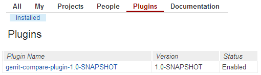

#Gerrit-Compare-Plugin
Diff tool designed for "Structural Programming"

-------------------------

##Introduction

 Gerrit-Compare-Plugin, a language-aware diff tool, makes reviews easier by showing changes of selected property/method name in a side-by-side display, and allowing inline comments to be added by any reviewer. It compares source code  syntactically rather than traditional paradigm of comparing lines and characters. This helps us to trace actual changes, even if methods are moved to another location or appear in different order.

##Features

 Following are some of the main features of Gerrit-Compare-Plugin:

- Refactor detection. It can find renamed, moved, reordered, wrapped, lifted, combined or fragmented code. Structured Difference allows focusing on the actual changes because it ignores location. Compare this for example with the regular file based difference that reports the entire method as new and deleted and therefore making the actual changes untraceable.
- Format insensitivity. The comparison result will not be affected by linebreaks or whitespaces.
- Navigation tree. The Navigation tree shows a hierarchal overview of changed, added and removed entities. This allows fast navigation to inspect change details.
- Comprehensible output. The interactive UI helps users to navigate and understand changes efficiently.

##Download

Please click [here](https://github.com/amitanjani/gerrit-compare-plugin/archive/master.zip) to download the latest version of Gerrit-Compare-Plugin.

##Building

In order to build Gerrit-Compare-Plugin you will need the following applications:

- Java JDK 6 (http://www.oracle.com/technetwork/java/javase/downloads/index.html).
- Apache Maven 3.x (http://maven.apache.org/)

To build Gerrit-Compare-Plugin, open your console, change to Gerrit-Compare-Plugin folder where pom.xml file is placed, and issue this command :

<pre>
    mvn package
</pre>

##Deployment

Copy *"gerrit-compare-plugin\gerrit-compare-ui\target\gerrit-compare-plugin-x.x-SNAPSHOT.jar"* to your gerrit setup plugin folder. No need to restart server, Plugins are automatically scanned and loaded.

##Bugs
If you find an issue, let us know [here](https://github.com/sans-sense/GerritStructuralComparatorPlugin/issues?page=1&state=open) 

